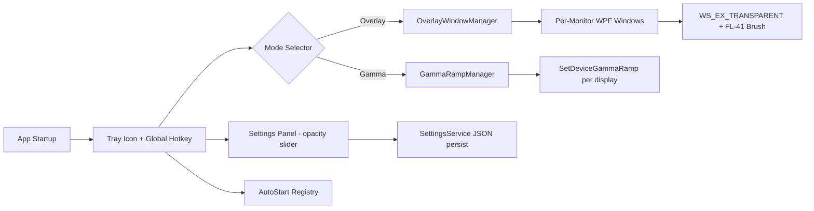

# Visual Snow FL-41 Ekran Katmanı Uygulaması — Mimari Plan

## Amaç
Visual Snow Syndrome (VSS) ve fotofobi için ekranı FL-41 (rose-amber) renk spektrumuna dönüştüren, çok hafif, üst katmanda çalışan bir WPF masaüstü katmanı.

---

## Araştırma Bulguları (Tavily + Context7)

### 1. FL-41 Spektral Gerçekleri
- **FL-41** = "Fluorescent 41", 1980'lerde geliştirildi. Rose/amber (gül kurusu) renk.
- **Hedef blokaj**: 480–520 nm (mavi-yeşil spektrum) — fotofobi ve miglenin ana tetikleyicisi.
- **İki yoğunluk**: Indoor (~%25 ışık blokajı, hafif rose), Outdoor (~%80 mavi blokajı, koyu).
- **Gerçek FL-41 tonu**: Saf pembe DEĞİL — sıcak, kahverengi-turuncu alt tona sahip rose-amber.
- Kullanıcının `#E0A9AF` (RGB 224,169,175) değeri makul bir indoor FL-41 yaklaşımıdır; ancak gerçek FL-41 biraz daha sıcak (turuncu-kahve alt tonlu). Önerilen ek preset: `#D98C8C` / `#C97F7F` (daha sıcak outdoor benzeri).
- **Klinik kanıt**: FL-41, fotofobi yollarında (S1, S2, insula, ACC) BOLD aktivasyonu anlamlı azaltır (PMC10939838).

### 2. WPF Click-Through / Layered Window Mekaniği
- `AllowsTransparency=True` + `WindowStyle=None` zorunlu (WPF exception fırlatır aksi halde).
- `AllowsTransparency=True` → `UsesPerPixelOpacity=True` → Win32 `WS_EX_LAYERED` otomatik eklenir.
- **Click-through için**: HWND üzerinden `SetWindowLongPtr` ile `WS_EX_TRANSPARENT | WS_EX_LAYERED` eklenir.
- HWND elde etme: `HwndSource.FromVisual(this).Handle` veya `PresentationSource.FromVisual`.
- **Kritik tuzak**: Tamamen şeffaf (alpha=0) layered window Windows tarafından "hollow" sayılır. Çözüm: `Color.FromArgb(1,0,0,0)` veya renkli brush (bizim durumumuzda FL-41 renkli brush — bu sorunu otomatik çözer).
- **Layered mode construction-time**: Pencere oluşturulduktan sonra değiştirilemez. Click-through'u runtime'da `WS_EX_TRANSPARENT` flag toggle ile aç/kapa yapabiliriz (layered flag sabit kalır).
- `WS_EX_TOOLWINDOW` ekleyerek Alt-Tab/taskbarda görünmemesini sağla.

### 3. GPU Optimizasyonu (RTX 4050 / Ryzen iGPU)
- WPF varsayılan DirectX donanım render kullanır.
- Statik tek-renk dolgu → GPU maliyeti **neredeyse sıfır** (tek kare, re-composite dışında yeniden render yok).
- **Dikkat**: Intel iGPU + WPF bilinen yüksek bellek tüketimi sorunu (~150MB). Çözüm: `RenderOptions.ProcessRenderMode = SoftwareOnly` opsiyonu — ama statik overlay için donanım render daha verimli. Sadece sorun çıkarsa software fallback.
- Optimizasyon kuralları:
  - Animasyon/flicker YOK (VSS için flicker tetikleyici!).
  - `IsHitTestVisible=False` kök elemanda.
  - Timer/DispatcherTimer kullanma — sadece opacity değişiminde tek seferlik güncelleme.
  - `RenderOptions.ProcessRenderMode` default (Hardware) bırak.
  - `BitmapScalingMode` vs. gereksiz — statik renk.

### 4. Çoklu Monitör & DPI
- WPF .NET 4.6.2+ per-monitor DPI destekler.
- `app.manifest` → `dpiAwareness = PerMonitorV2` ayarla.
- **Strateji**: Her monitör için ayrı overlay penceresi (virtual screen tek pencere yerine) — DPI tutarlılığı ve tek monitörde kapatma esnekliği için.

---

## KRİTİK MİMARİ KARAR: Overlay Window vs Gamma Ramp

> **KARAR VERİLDİ: HİBRİT** — Her iki mod da uygulanacak, tray menüsünden geçiş yapılacak.
> İş/masaüstü için Overlay (hassas FL-41 + opaklık), oyun için Gamma (fullscreen uyumlu, sıfır yük).

Bu, oyun oynama (RTX 4050) ve pil (Ryzen iGPU) senaryoları için **en önemli** karardır:

### Seçenek A — Overlay Window (kullanıcının istediği)
- ✅ Tam FL-41 rengini ve opaklık kontrolü kesin.
- ✅ Click-through ile alt pencerelere dokunmaz.
- ❌ **Exclusive fullscreen oyunlarda ÇALIŞMAZ** (oyun topmost'u geçer).
- ❌ Borderless oyunlarda ek composite katmanı → hafif input lag, ekran yakalama (OBS) sorunları.
- ❌ iGPU'da ekran kompozisyonuna ek yük.

### Seçenek B — Gamma Ramp API (`SetDeviceGammaRamp`)
- f.lux / Windows Night Light'in kullandığı yöntem.
- Ekranın donanımsal gamma/white-point LUT'unu değiştirir.
- ✅ **Exclusive fullscreen dahil her yerde çalışır** — oyun dostu.
- ✅ **Sıfır overlay yükü** — GPU'yu yormaz, pil dostu.
- ✅ RTX 4050 oyun performansını etkilemez.
- ❌ Windows Night Light ile çakışır (Night Light kapatılmalı).
- ❌ Bazı sürücüler/monitörler resetler; periyodik yenileme gerekir.
- ❌ Kesin opaklık kontrolü sınırlı (gamma eğrisi ile yaklaşık FL-41 tonu).

### Önerilen Hibrit Yaklaşım
**Her iki modu da uygula**, kullanıcı seçsin:
- "Overlay" modu (hassas FL-41 renk + opaklık, masaüstü/iş).
- "Gamma" modu (oyun dostu, düşük yük, fullscreen).
- Tray menüsünden geçiş.

---

## Sistem Mimarisi

## Bileşenler

| Bileşen | Sorumluluk |
|---|---|
| `App.xaml/cs` | Startup, tray, hotkey, DPI manifest |
| `OverlayWindow` | Tek monitör FL-41 click-through penceresi |
| `OverlayWindowManager` | Per-monitor pencere oluşturma/DPI/yerleşim |
| `GammaRampManager` | `SetDeviceGammaRamp` P/Invoke, per-display |
| `NativeMethods` | Win32 P/Invoke (SetWindowLongPtr, WS_EX_*, SetDeviceGammaRamp) |
| `SettingsService` | JSON config (renk, opaklık, mod, enabled, autostart) |
| `SettingsViewModel` | Opaklık kaydırıcı binding, renk preset seçimi |
| `TrayIconController` | NotifyIcon, context menu, toggle |
| `HotkeyService` | Global klavye kısayolu (RegisterHotKey) |

## FL-41 Renk Presetleri
- **Indoor FL-41**: `#E0A9AF` (kullanıcı önerisi, RGB 224,169,175)
- **Warm FL-41**: `#D98C8C` (daha sıcak, outdoor benzeri)
- **Deep FL-41**: `#C97F7F` (yoğun, koyu ortam)
- **Custom**: renk seçici + opaklık (varsayılan %30-50 alpha)

## Global Kısayollar (önerilen)
- `Ctrl+Alt+F` → Overlay aç/kapa
- `Ctrl+Alt+O` → Opaklık paneli aç
- `Ctrl+Alt+M` → Mod değiştir (Overlay ↔ Gamma)

## VSS Güvenlik Kuralları
- **Flicker/animasyon YASAK** — statik tint sadece.
- Geçişlerde fade animasyonu yok (anında geçiş).
- Opaklık değişimi anlık (slider drag sırasında bile smooth ama kısa).
- Varsayılan opaklık düşük başlasın (%20-30), kullanıcı yükseltsin.

## Teknoloji Stack
- .NET 8 (LTS) — WPF
- C# 12
- Hedef framework: `net8.0-windows`
- `UseWPF` SDK özelliği
- Ek NuGet: yok (sadece Win32 P/Invoke + WPF yerleşik)